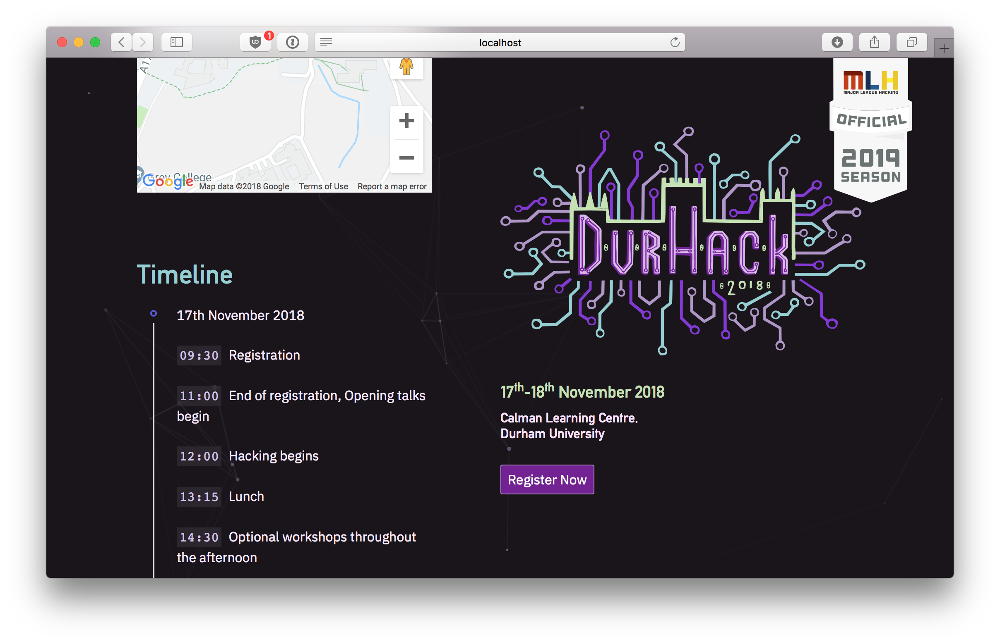

# ARCHIVED: This repository is no longer active
This repository represents an **old version** of the DurHack website.

As of Tuesday 5th November 2019, the [DurHack website](https://durhack.com) now uses the [ducompsoc/durhack](https://github.com/ducompsoc/durhack) repository.

# DurHack



These are website assets for the DurHack hackathon (the fourth one, as of the write-up of this README).

## Quick Start

Hopefully, it should be as trivial as cloning the repo, `cd`ing into the repository, and slapping the following commands into the terminal (assuming `node.js` is installed):

```
cd src/
npm start
```

> Having trouble with node v12? Try using v10. [nvm](https://github.com/nvm-sh/nvm) is a great way to set this up.

## Development

You can run the asset watcher (which will re-build the assets every time you change them) with:

```
npm run watch
```

Relevant JS and CSS files to edit are in the following two directories respectively:

```
src/assets/js/
src/assets/sass
```

**Do not edit the contents of ```src/assets/vendor/```**.

## deployment

Presently, we've used a Digital Ocean box which is covered through the Github Student Pack. [`pm2`](http://pm2.keymetrics.io) is used to run the service as a daemon, with `nginx` acting as a reverse proxy. SSL certificates were created using Let's Encrypt (A good tutorial on how to do this yourself can be found [here](https://www.digitalocean.com/community/tutorials/how-to-secure-nginx-with-let-s-encrypt-on-ubuntu-16-04).) Optionally, there are lots of open source scripts that will act as a git webhook, allowing changes to be deployed as soon as changes are pushed into your repo (similar to how Heroku works), but I'm not sensible enough to allow that to be deployed.

## blah blah blah ok w/e but can I use this for my own hackathon website?

Sure, but obviously don't use our logo and colourscheme or whatever. That'll be silly.
